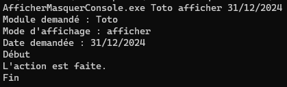
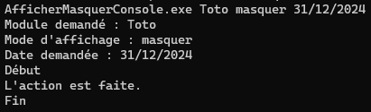

# AfficherMasquerConsole

But : lancer une application Console avec un paramètre d'affichage de la fenêtre.

Cette **solution d'exemple** fournit un programme à lancer en **Invite de commandes** Windows avec le passage d'argument `afficher` ou `masquer` obligatoire. 

Pour illustrer ce passage d'arguments, sont posés en plus : le nom obligatoire d'une entité quelconque, une date optionnelle. Aucun test n'est effectué sur ces valeurs pour ne pas alourdir inutilement le propos.

## Exemple 1

Dans un terminal, se positionner dans le dossier du programme puis exécuter la commande suivante :

```
AfficherMasquerConsole.exe Toto afficher 31/12/2024
```



La fenêtre reste à l'écran.

## Exemple 2

Dans un terminal, se positionner dans le dossier du programme puis exécuter la commande suivante :

```
AfficherMasquerConsole.exe Toto masquer 31/12/2024
```

La fenêtre du terminal est minimisée. Agrandir la fenêtre pour consulter le résultat :



## Exemple 3

Exécuter le fichier `lancer.bat` qui contient la même commande que celle de l'exemple 2 :

```
AfficherMasquerConsole.exe Toto masquer 31/12/2024
```

La fenêtre du terminal n'apparaît pas. Lancer le **Gestionnaire de tâches** Windows pour constater que le programme s'exécute :


